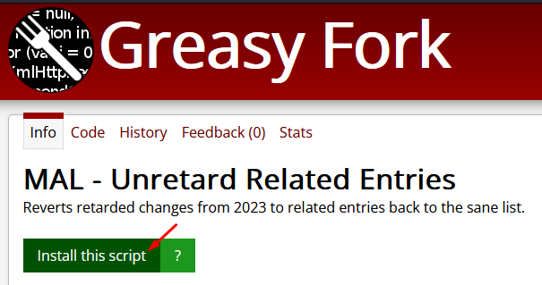
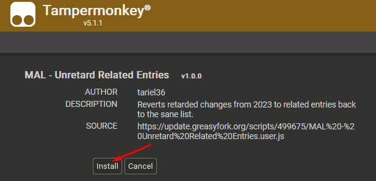
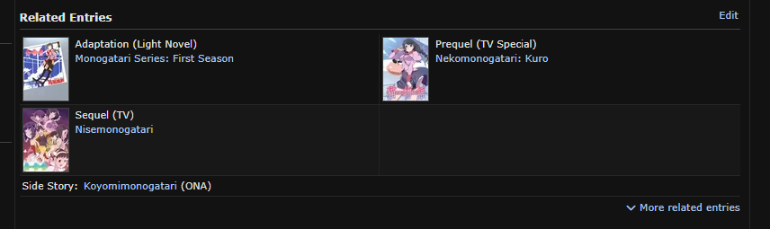
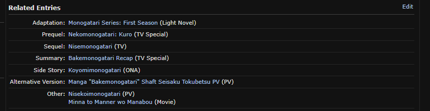

# MyAnimeList Unretard Related Entries
Reverts changes to Related Entries from [2024-05-24 MAL update](https://myanimelist.net/forum/?topicid=2161325) to normal, sane sorted, expanded list.

## 📝 Table of Contents

  * [How to Install](#install)
  * [FAQ](#faq)
  * [Examples / Screenshots](#screenshots)

## 💻 How to Install 

1. Download and install [Tampermonkey](https://www.tampermonkey.net/);
2. [Click Here](https://greasyfork.org/en/scripts/499675-mal-unretard-related-entries) to open the script on Greasy Fork;
3. Click "Install this script" ;
4. Click "Install" ;
5. Open [MAL](https://myanimelist.net/), and navigate to any anime details page;
6. Done, enjoy normal list;

## ❓ FAQ 

1. <b>I've encountered a bug?</b> Please submit a [bug report](https://github.com/tariel36/MAL-Unretard-Related-Entries/issues/new/choose);
1. <b>I've got a great idea?</b> Please submit a [feature request](https://github.com/tariel36/MAL-Unretard-Related-Entries/issues/new/choose);

## 📸 Examples / Screenshots 

### Before

### After

